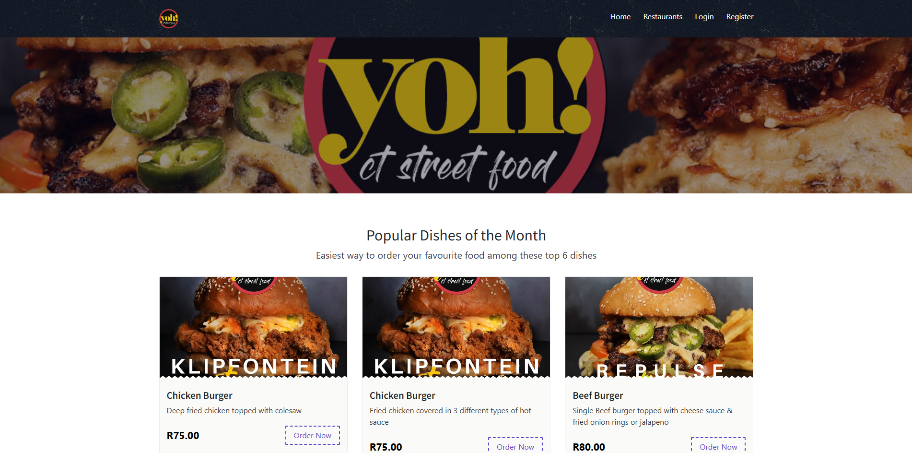
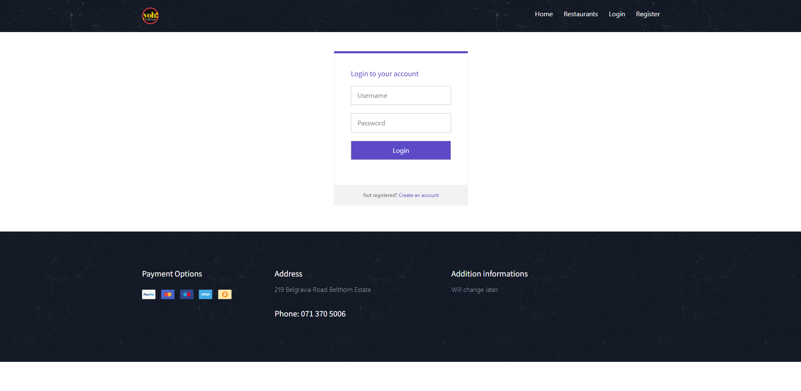
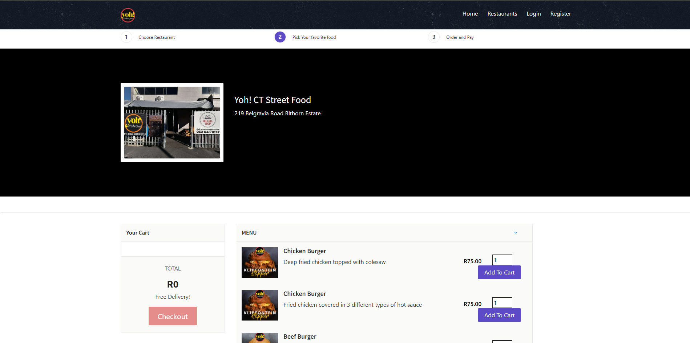
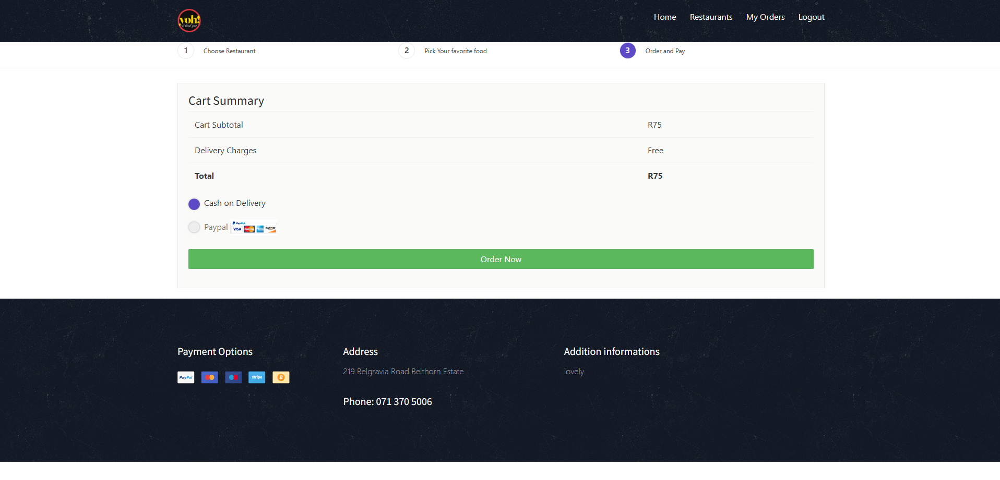
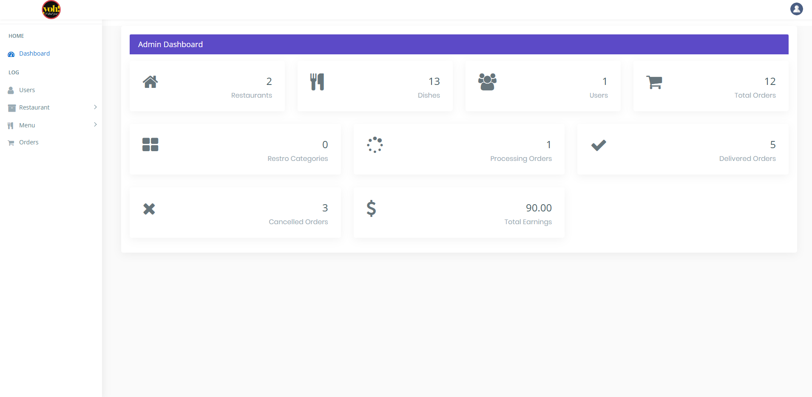

# YOH! Fast Food Management System

## 📝 Project Overview
YOH! Fast Food is a web-based application designed to streamline fast food restaurant operations. It provides users with an intuitive interface to browse menus, place orders, and manage restaurant operations effectively. The system also includes administrative tools for managing restaurants, dishes, and customer orders.

_The homepage showcasing the restaurant menu and navigation options._

---

## 🌟 Features

### User Features:
- User registration and login system:
  
  _Login page for users and admins._
- Browse restaurant menus and dishes:
  
  _Menu page displaying restaurant dishes._
- Place orders and view order history:
  
  _Order placement screen with item details and checkout button._

### Admin Features:
- Add, edit, and delete restaurants and dishes:
  
  _Admin dashboard for managing restaurants and dishes._
- View and manage customer orders.

### Core Functionalities:
- Secure login/logout functionality.
- Dynamic menu display with database integration.
- Checkout and order confirmation system.

---

## ⚙️ Technologies Used
- **Frontend**: HTML, CSS, SCSS, JavaScript  
- **Backend**: PHP  
- **Database**: MySQL  
- **Other Tools**: Fonts, images, and additional assets for UI/UX design.

---

## 🚀 Setup and Installation

### Requirements:
- A local server setup (e.g., XAMPP, WAMP, or LAMP).
- PHP 7.4+.
- MySQL database.

### Steps:
1. **Download or Clone** the project files.
2. **Extract** the files into your web server's root directory (e.g., `htdocs` for XAMPP).
3. **Import the MySQL database**:
   - Open `phpMyAdmin`.
   - Create a new database (e.g., `yoh_fast_food`).
   - Import the `.sql` file located in the `DATABASE FILE` folder.
   
   _Database structure in phpMyAdmin._
4. **Configure the database connection**:
   - Edit the connection file in the project directory.
   - Update the database name, username, and password to match your setup.
5. **Start the server** and access the project via your browser (e.g., `http://localhost/YOH_Fast_food`).

---

## 🛠️ Usage Instructions

### Users:
- Register and log in to place orders and view past orders.

### Admins:
- Log in using admin credentials to manage restaurants, dishes, and customer orders.

---

## 📁 File Structure

### Frontend:
- `index.html`: Homepage of the application.
- `css/`, `scss/`, `images/`, `js/`: Contains styles, scripts, and assets for the UI.

### Backend:
- `login.php`, `logout.php`, `registration.php`: Handles authentication.
- `checkout.php`, `product-action.php`, `your_orders.php`: Manages orders and user interactions.
- `admin/`, `restaurants.php`, `dishes.php`: Admin and restaurant management features.

### Database:
- `DATABASE FILE/`: Contains the MySQL database structure and data.
